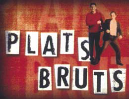

<p align="center">
  
</p>

# Plats Bruts API

> API REST estàtica amb dades sobre la sitcom catalana **Plats Bruts** (TV3, 1999-2002), inspirada en [PokéAPI](https://pokeapi.co/). Hostatjada gratuïtament a GitHub Pages, sense autenticació i sense límits.

🌐 **Documentació i guia d'ús:** <https://kaarloost.github.io/plats_bruts_api/>
🔗 **URL base de l'API:** `https://kaarloost.github.io/plats_bruts_api/api/v1/`

> ⚠️ Projecte de fans, sense afiliació amb TV3 ni la productora. Dades extretes de Viquipèdia (CC BY-SA 4.0).

---

## Què hi ha disponible

| Recurs | Quantitat | Endpoint d'índex |
|---|---:|---|
| Personatges | 9 | `/personatges/index.json` |
| Episodis | 73 | `/episodis/index.json` |
| Temporades | 6 | `/temporades/index.json` |
| Cites | ~777 | `/cites/index.json` |
| Localitzacions | 5 | `/localitzacions/index.json` |

Cada **personatge** ve amb la seva descripció (uns 1.500 caràcters de prosa biogràfica de Viquipèdia) i l'actor que el va interpretar. Cada **episodi** porta la sinopsi completa (300-1.500 caràcters). Les **cites** són diàlegs reals extrets de [Wikiquote en català](https://ca.wikiquote.org/wiki/Categoria:Plats_Bruts), atribuïdes al personatge i episodi.

Cada índex retorna `{ "count": N, "results": [...] }`. Cada fitxa de detall viu en una URL pròpia, p. ex. `/personatges/josep-lopes.json` o `/episodis/1x01.json`.

## Exemple ràpid

```js
const BASE = "https://kaarloost.github.io/plats_bruts_api/api/v1";

const lopes = await fetch(`${BASE}/personatges/josep-lopes.json`).then(r => r.json());
console.log(lopes.nom); // "Josep Lopes"

const ep = await fetch(`${BASE}/episodis/1x01.json`).then(r => r.json());
console.log(ep.titol, ep.data_emissio); // "Tinc pis" "1999-04-19"
```

```bash
curl https://kaarloost.github.io/plats_bruts_api/api/v1/temporades/index.json
```

Per a més exemples (Python, esquemes de fitxa, CORS, versionat…) consulta la [pàgina de documentació](https://kaarloost.github.io/plats_bruts_api/).

---

## Com funciona

```
Viquipèdia (ca) ──► scraper (Python) ──► JSON estàtic ──► GitHub Pages ──► clients
                          │
                          └── overrides manuals (data/overrides.json)
```

El scraper baixa dos articles de Viquipèdia (la [llista de personatges](https://ca.wikipedia.org/wiki/Llista_de_personatges_de_Plats_bruts) i la [llista d'episodis](https://ca.wikipedia.org/wiki/Llista_d%27episodis_de_Plats_bruts)), els analitza amb BeautifulSoup, fusiona les correccions/afegits manuals de `data/overrides.json` i emet l'arbre JSON sota `api/v1/`. Tot es commiteja al repo i GitHub Pages el publica.

## Estructura del repositori

```
plats_bruts_api/
├── api/v1/                   ← API publicada (servida per GitHub Pages)
├── scraper/                  ← codi del scraper (Python)
│   ├── sources/wikipedia_ca.py
│   ├── models.py
│   ├── overrides.py
│   ├── emit.py
│   ├── build.py
│   └── tests/
├── data/overrides.json       ← correccions i dades curades manualment
├── index.html                ← landing page (documentació)
└── .github/workflows/        ← deploy + rebuild
```

## Desenvolupament local

Requereix Python 3.11+.

```bash
# Instal·lar dependències
pip install -e ".[dev]"

# Executar tests
pytest

# Regenerar tot l'arbre JSON des de Viquipèdia
python -m scraper.build
```

El scraper cacheja les pàgines de Viquipèdia a `scraper/.cache/` (ignorat per Git), així que iteracions successives no martelegen el servidor.

## Contribuir

Vols afegir cites mítiques, descripcions de personatges o localitzacions? Edita `data/overrides.json` i envia un pull request. Format:

```json
{
  "personatges": {
    "josep-lopes": {
      "descripcio": "Locutor de ràdio i un dels protagonistes...",
      "actor": { "slug": "jordi-sanchez", "nom": "Jordi Sànchez" }
    }
  },
  "cites": [
    { "id": "c001", "text": "Que potes!", "personatge": "josep-lopes", "episodi": "1x01" }
  ],
  "localitzacions": [
    { "slug": "el-pis", "nom": "El pis", "descripcio": "L'apartament que comparteixen Lopes i David." }
  ]
}
```

Després d'un merge a `main`, el deploy a GitHub Pages s'executa automàticament i la nova versió de l'API queda en línia en uns segons.

## Versionat

Tot viu sota `/api/v1/`. Si en el futur cal trencar compatibilitat es publicarà `/api/v2/`; la `v1` continuarà funcionant inalterada.

## Llicència

Triple (cada part en la seva):

- **Codi** (tot el contingut de `scraper/`, configuració, HTML de documentació) → [MIT](LICENSE). Pots fer-lo servir lliurement per a qualsevol propòsit, també comercial.
- **Dades** (tots els fitxers JSON sota `api/v1/`) → [CC BY-SA 4.0](LICENSE-DATA). Heretat de Viquipèdia. Si reutilitzes les dades has d'atribuir la font (cada fitxa porta un camp `font_wikipedia`) i compartir els derivats amb la mateixa llicència.
- **Material gràfic** (logotip i derivats sota `assets/`) → propietat de **TV3 / El Terrat**. Detalls a [NOTICE](NOTICE). Aquí s'usa amb propòsit identificatiu, no comercial, anàlogament a com Viquipèdia mostra el mateix logotip a l'article de la sèrie.
